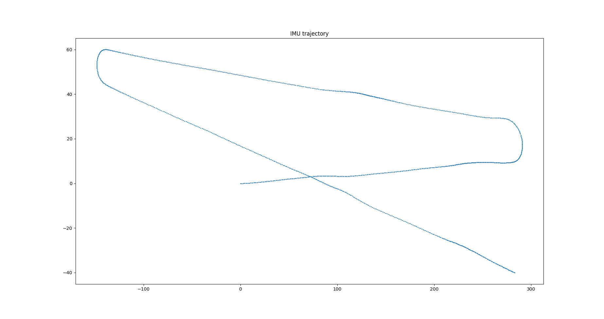
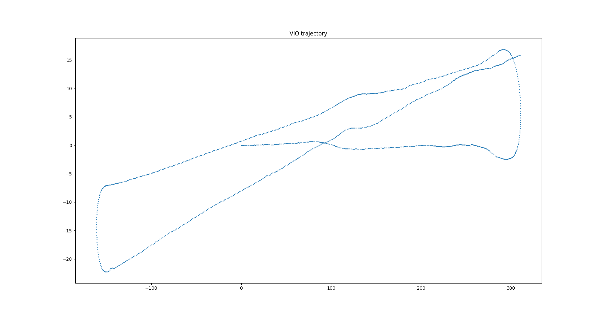
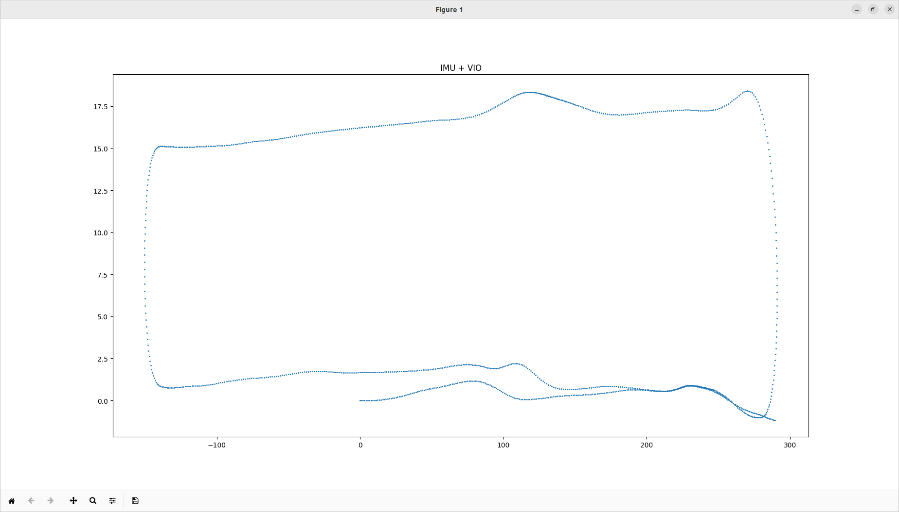

Python version of robot_localization pkg in ROS.

`ekf.py` has class `ekf` which implements sensor fusion in robot_localization.

`helper/getVIO.py` and `helper/getOdometry.py` generate `imu.npy` and `vo.npy` for running an example in `ekf`.

Explanation of algorithm is written in report pdf.

# Example

## IMU trajectory

## Visual Odometry trajectory

## Sensor fusion (ekf)

