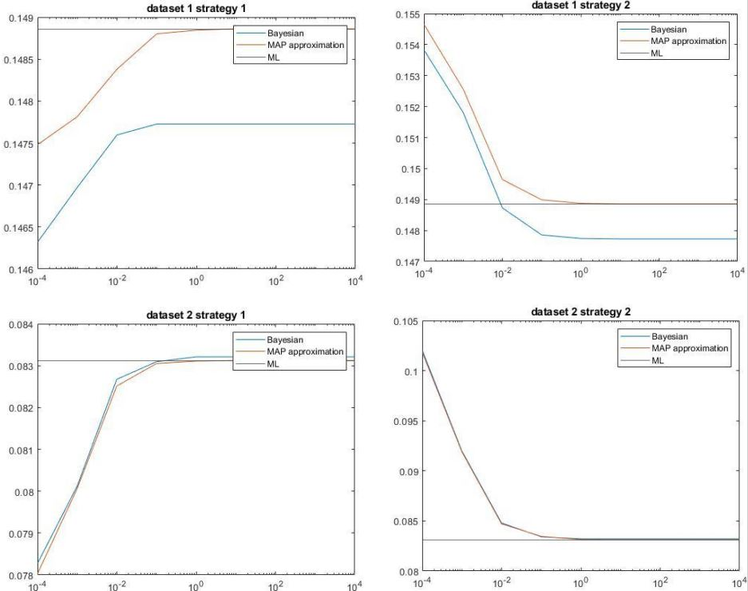
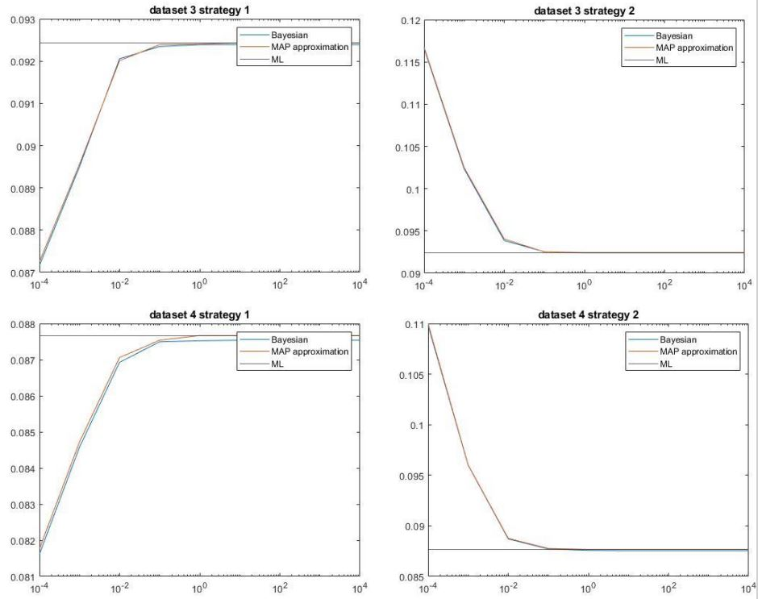

# Foreground/background segmentation

Original image

Ground truth

## PR1: Second largest representative factor
Use second largest fft coefficient as the indicator to do segmentation.

Result

## PR3: 

Result
### x-axis: alpha y-axis: error

