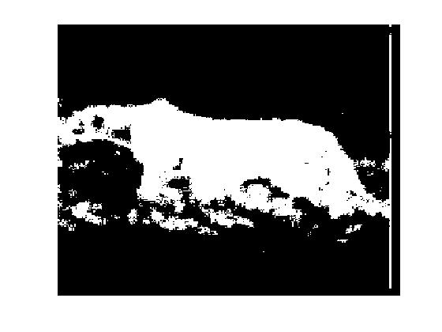

# Foreground/background segmentation
Perform image segmentation via statistical learning. 

Use fft coefficients as features to create gaussian distributions for background and foregound on training data. Then, classify pixels in target image by the distributions.

Original image

Ground truth

## PR1: Second largest representative factor
Use second largest fft coefficient as the feature to do segmentation because the largest one is always DC signal.

Result:

Error rate: 0.1816

## PR2: Multivariate features (64d and 8d)
Use all fft coefficitents (64d) to build classifier, then select top eight representative coefficients (8d) to build classifier.

64d result:

Error rate: 0.094

8d result:

Error rate: 0.063

## PR3,4: 

Result
### x-axis: alpha y-axis: error

