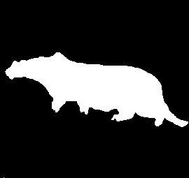

# Foreground/background segmentation
Perform image segmentation via statistical learning. 

Use fft coefficients as features to create gaussian distributions for background and foregound on training data. Then, classify pixels in target image by the distributions.

Original image

Ground truth

## PR1: Second largest representative factor
Use second largest fft coefficient as the feature to do segmentation.

Result

## PR3,4: 

Result
### x-axis: alpha y-axis: error

