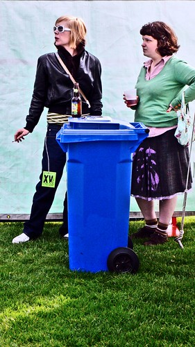
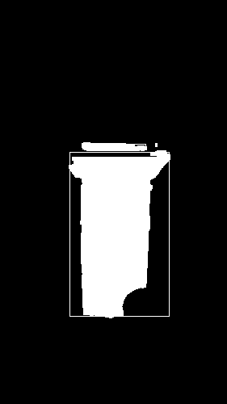
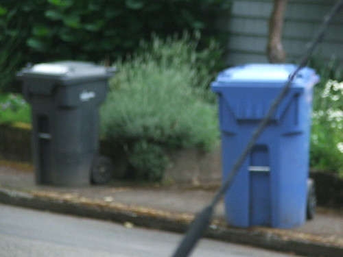
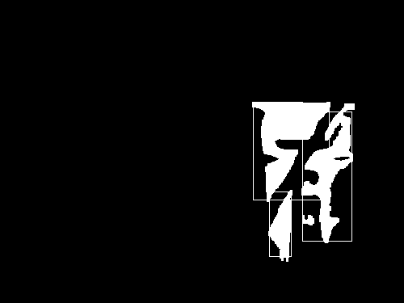
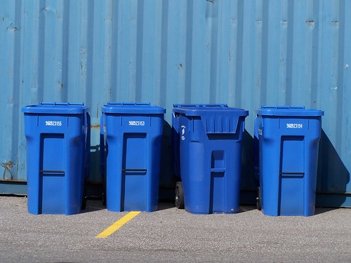
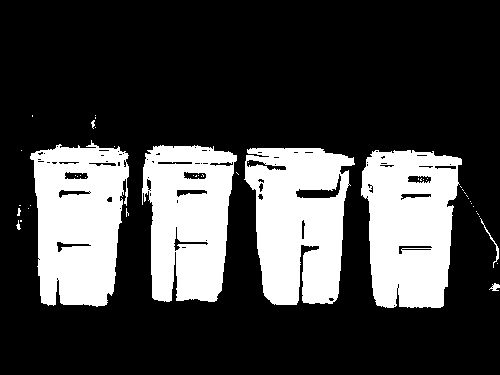
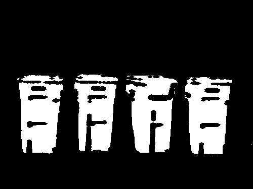
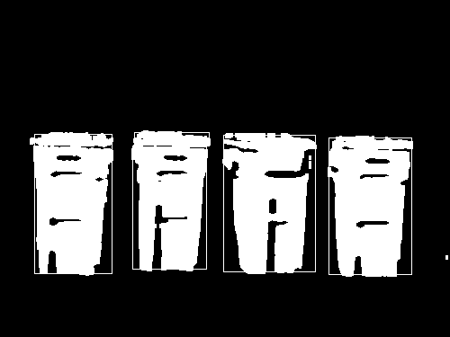
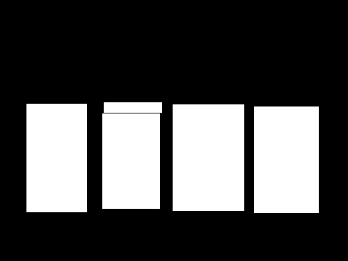

# Blue-bin detector via logistic regression
Develop a blue-bin detector via logistic regression on color classification and morphological properties of detected blue regions.
## Process
1. identify blue region (color of recycling bin)

2. image processing (erosion and dilation)

3. use bounding box to do annotation

4. create the mask for detected bin

## ex1
target:

blue extraction:

image processing:

bounding box:

mask:

## ex2
target:

blue extraction:

image processing:

bounding box:

mask:

## ex3
target:

blue extraction:

image processing:

bounding box:

mask:

