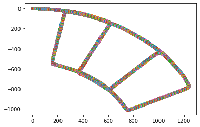

# Particle Filter Fast SLAM
Perform fast SLAM based on particle filter.

[Report](https://github.com/hsyen23/course-projects/blob/main/ECE276A_Sensing%20%26%20Estimation%20in%20Robotics/PR2_particle%20filter%20fast%20SLAM/A59010599_Yen_PR2.pdf)

## Process
1. create particles to represent discretized distribution of robot's position.

2. predict particles' pose based on input data with differential drive model.

3. update weights via scan-matching with previous map.

4. select highest weighted particle as current pose of robot and update map.

5. resample particles if number of effective particles is low.

6. iteratively run 2~5 steps.

## Result:
ground truth:

dead reckoning with noise:

particle filter (3 particle):

particle filter (50 particle):

### Note
The accuracy highly depends on our scan-matching method. A finer scan-matching method such as ICP and loop-closure will enhance overall performance for fast SLAM! 
