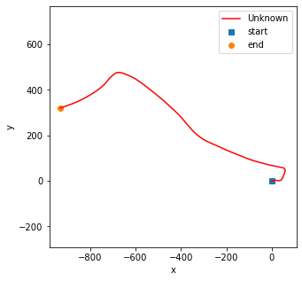
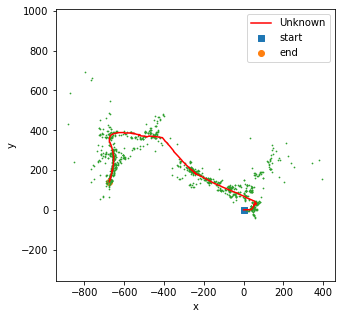
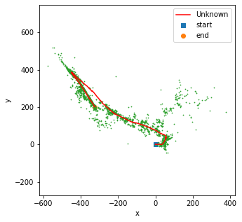
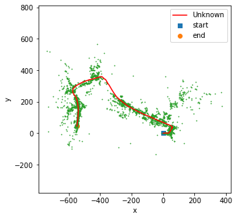
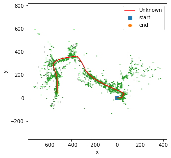
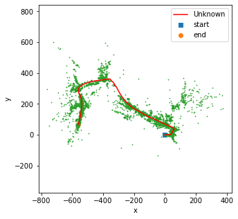

# Visual-Interial SLAM
Perform SLAM with landmark mapping via EKF.

Report: https://github.com/hsyen23/course-projects/blob/main/ECE276A_Sensing%20%26%20Estimation%20in%20Robotics/PR1_blue%20bin%20detection%20(object%20detection)/A59010599_Yen_PR1.pdf

## Process
1. use ORB to extract landmarks from stereo camera.

2. use EKF to estimate distribution of position of each landmark (update map).

3. use EKF to estimate robot's pose via IMU and stero camera (update robot's pose).

4. iteratively run 2~3 steps.

## Result:

dead reckoning:

SLAM based on 20% landmarks:

SLAM based on 40% landmarks:

SLAM based on 60% landmarks:

SLAM based on 80% landmarks:

SLAM based on 100% landmarks:

