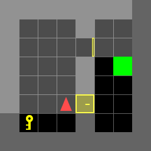
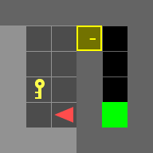
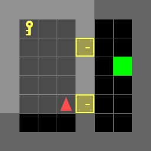

# Dynamic programming
Use dynamic programming to solve maze puzzle with minimum steps.

[Report](https://github.com/hsyen23/course-projects/blob/main/ECE276B_Planning%20%26%20Learning%20in%20Robotics/PR1_dynamic%20programming/A59010599_Yen_PR1.pdf)

## ex1

## ex2

## ex3

