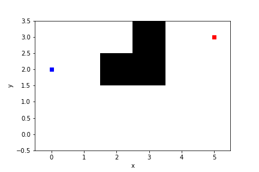

# Motion planning

Reconstruct agent-chasing with time-constraint problem into DSP (deterministic shortest path) problem with dynamic environment, and apply real-time adaptive A* algorithm to find the feasible path.

[Report](https://github.com/hsyen23/course-projects/blob/main/ECE276B_Planning%20%26%20Learning%20in%20Robotics/PR2_motion%20planning/A59010599_Yen_PR2.pdf)

## ex1

