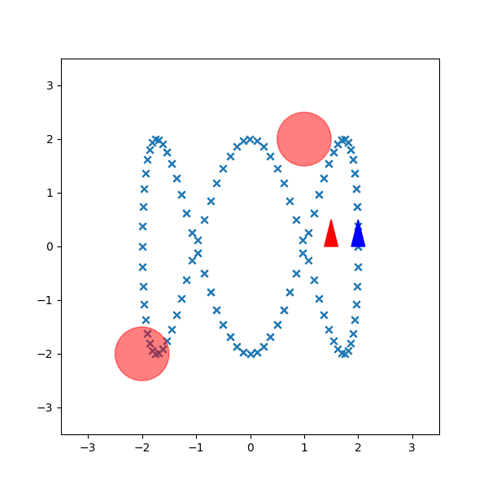

# Infinite-Horizon Stochastic Optimal Control
Use CEC (certain equivalent control) to set stochastic optimal control problem into deterministic optimal control problem.

In this report, we use LQR controller with Receding Horizon Control to make this problem NLP (nonlinear programming).

[Report](https://github.com/hsyen23/course-projects/blob/main/ECE276B_Planning%20%26%20Learning%20in%20Robotics/PR3_Infinite-Horizon%20Stochastic%20Optimal%20Control/A59010599_Yen_PR3.pdf)

## P controller
Use P controller which only takes current time-stamp information into consideration.

The path created by red agent fits poorly with desired path.

## RHC
### First, find suitable time-step length for RHC without collision checking.

time-step = 5

time-step = 10

time-step = 20

We can see that choosing time-step to 10 is good enough.

### Second, select suitable Q,R for LQR controller with collision checking.

Q=0.5, R=0.5

Q=1, R=1

Q=1, R=3

(Q=1, R=1) is a good parameter for the cost function.

### Third, improve safety by increasing obstacles' radius.

r=0.25

r=0.3

